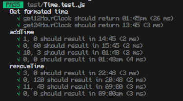
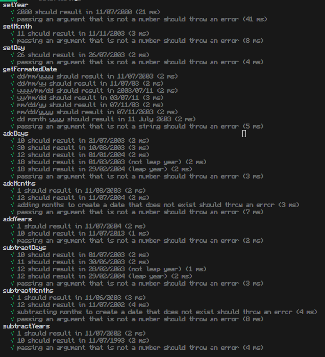

# Test report

To run the automatic tests, do the following commands:
1. npm i
2. npm run test

### **22/10/2023: All tests pass (61 passed, 61 total)**

Functions that are tested in Time:
- setHour
- setMinute
- getTimeIn12HourClockFormat
- getTimeIn24HourClockFormat
- addMinutes
- addHours
- subtractMinutes
- subtractHours

Functions that are tested in Date:
- setDay
- setMonth
- setYear
- getFormatedDate
- addDays
- addMonths
- addYears
- subtractDays
- subtractMonths
- subtractYears

