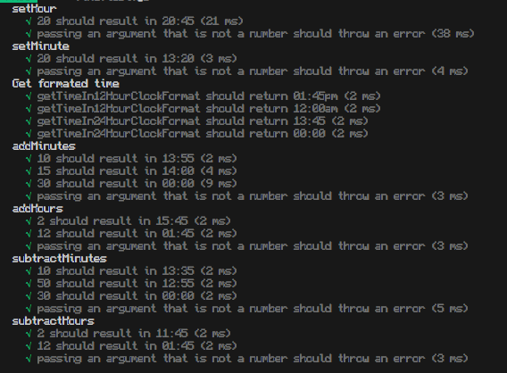

To run the automatic tests, do the following commands:
1. npm i
2. npm run test

### **26/9/2023: All tests pass (24 passed, 24 total)**

Functions that are tested in Time:
- get12HourClock
- get24HourClock
- addTime
- removeTime

Functions that are tested in Date:
- getFormatedDate
- addTime
- removeTime

